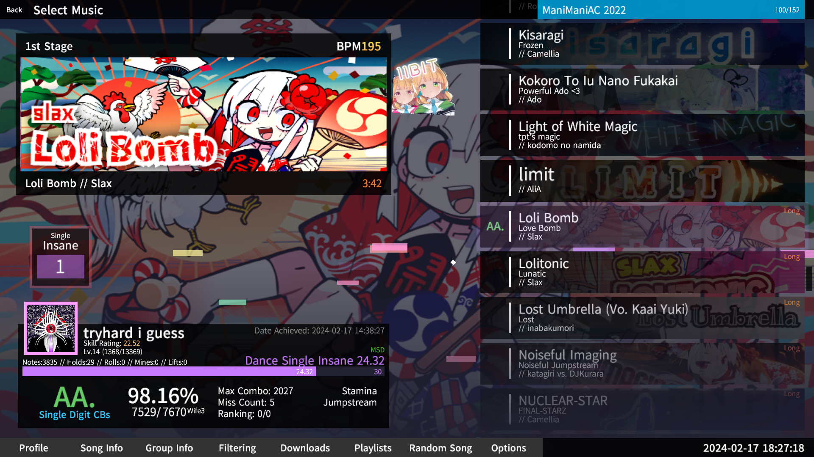

Refer to ca25nada's original repo for the original theme.
https://github.com/ca25nada/spawncamping-wallhack

Refer to poco's fork for development builds of this theme.
https://github.com/poco0317/spawncamping-wallhack

---
# spawncamping-wallhack
A SM5 Theme ported for Etterna, a client aimed primarily for KB players.

Here is a screenshot

Requirements: The latest release version of Etterna. Older releases are for SM5.

---
# Acknowledgements
### From Prim
* The StepMania 5 devs (notably freem and Kyzentun) for making this possible in the first place.
* People in #stepmania-devs and the Rhythm gamers discord for feedback.
* Some of the theme elements are adapted from the default theme or this by jousway https://github.com/Jousway/Stepmania-Zpawn
* Kyzentun's prefs system is used for setting various profile/theme preferences. (which is now available in _fallback for 5.1)

### From Poco
* Everyone, I love this game
---
